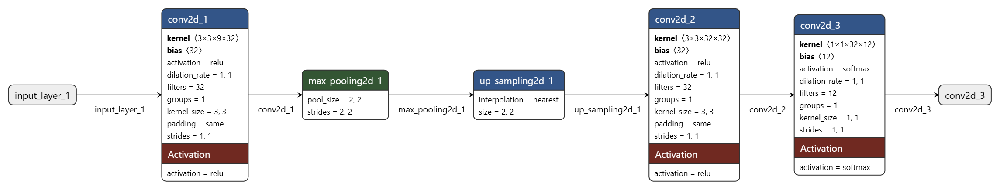
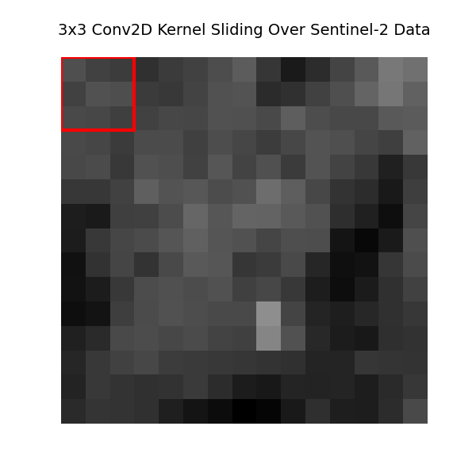
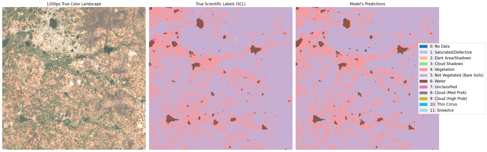

# Land Cover Segmentation using Sentinel-2 Satellite Imagery

This repository contains a deep learning project for semantic segmentation of satellite imagery. The objective is to accurately classify ground features, such as water, vegetation, and urban infrastructure, at a pixel level using remote sensing data.

The trained model achieved a test accuracy of 93.7% on completely unseen geographical data.

## Project Architecture

  

The core mathematical architecture used for this task is a Convolutional Neural Network (CNN). Specifically, an Encoder-Decoder structure known as a U-Net was built sequentially using TensorFlow and Keras.

1. **Preprocessing**: Sentinel-2 data (R20m spatial resolution) was stacked to create multi-spectral images consisting of 9 distinct spectral bands (including Near-Infrared for isolating vegetation).
2. **Data Manipulation**: The massive 5490x5490 spatial grids were geometrically tiled into manageable 64x64 patches. The target outputs were derived directly from the Scene Classification Layer (SCL) bounds and synchronized with the image inputs.
3. **Model Construction**:
    - **Encoder**: Extracts feature maps and down-samples the image chunks to map out the "big picture" context of the geography using 2D Convolutions and Max Pooling operations.
    - **Decoder**: Up-samples the data back to its original 64x64 geometric resolution to assign precise scientific labels to each isolated pixel boundary.
    - **Classifier**: The final output layer leverages a Softmax activation map over perfectly aligned 1x1 convolutions to select the dominant label from 12 distinct land cover categories.

## Visualizations

### Convolution in Action
Below is an animated visualization generated directly from the testing array showing a 3x3 convolution kernel sliding geometrically across a subset of the Sentinel-2 Red Band. This represents how the feature detectors interpret 2D visual structures in the initial layer of the network.

  

### Final Output Comparison
After training on the dataset, the model's multi-class predictions on entirely unseen validation patches were visualized against the true scientific ground labels encoded by the satellite.

## Technologies Used
- **TensorFlow / Keras**: Used for constructing, compiling, and training the U-Net structure.
- **Rasterio**: Used to process, parse, and extract NumPy matrices out of the `.jp2` format satellite data files.
- **NumPy**: Used for normalizing matrix values, stacking bands, and reshaping dimensional tensors.
- **Matplotlib**: Used for plotting complex 2D arrays and generating animated subplots from raw coordinate mappings.
